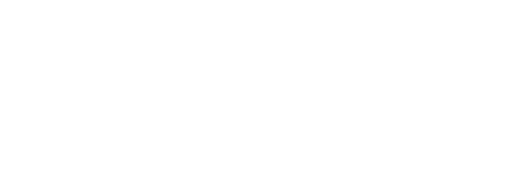

<style>
.outer {
    /* background:blue; */
    display:flex;
    flex-flow: row wrap;
    width:100%;
    height:90%;
}

.inner {
    /* background:green; */
    width:50%;
    display:flex;
    justify-content: center;
    align-items: center;  
}

.inner2 {
    /* background:red; */
    width: 70%;
}
</style>


<style>
section {
    font-size: 30px;
}
</style>

# Embedded Probabilistic Programming <br> in Rust

<style scoped>
  section {
    /* align-items: stretch; */
    display: flex;
    flex-flow: column nowrap;
    justify-content: center;
  }
</style>


## Modelling

- Human mind creates approximate models of world
  - How? No clue (._.')
- Science creates more precise approximate models of world
  - How? Math!
- Models specify structure, with open parameters
- E.g. Newton's law of gravity
  - $F = g \cdot m$
  - Structure: $F \sim m$
  - Parameter: $g$


## Probabilistic Modelling

- Don't try to model system exactly
- Treat it as a partially random process
- E.g. Coin flip
  - Don't try to predict singular throw (physics is hard)
  - Instead describe distribution of many throws
- Trade predictive power for tractability & generality
- → Bayesian statistics


## Probabilistic Programming

- _Usually:_
  - Take simple distributions
  - Combine them in some simple way
  - Do efficient inference
  - E.g. Generalized linear models
- _Instead:_
  - Take simple distributions
  - Combine them in most general way: Programming
  - Do somewhat less efficient inference
  - ⇒ **Probabilistic Programming**


## Probabilistic Programming _(cont.)_

- Take Turing-complete programming language
- Introduce probabilistic elements:
  - _sample_: Sample from distribution
  - _observe_: Observe value from distribution
- Develop general inference algorithm _(the hard part)_
- Generate samples from probabilistic program


## Example

- Is the coin we are flipping a fair coin?
- I.e. What weight explains our observations the best?

```rs
#[prob]
fn coin(observations: Vec<bool>) -> f64 {
    let weight = sample!(uniform(0., 1.));
    for o in &observations {
        observe!(bernoulli(weight), o);
    }
    weight
}
```

- ⇒ Probabilistic program represents structured space of programs


## Inference

- We have some probabilistic program
- How do we draw representative samples?
- Just run it?
  - Problem: How do we respect _observe_ statements?
- Solution: Markov Chain Monte Carlo


## Markov Chain Monte Carlo

- We want samples from a distribution $\pi$
- But we can only calculate it's density $\pi(x)$
- First idea: **Rejection Sampling**
  - Propose random values, accept them with probability $\pi(x)$
  - Problem: Inefficient
- Better idea: **Markov Chain Monte Carlo**
  - Propose random values, but not independently
  - Accept them with just the right probability
  - Prefer high-probability regions in _support_ of $\pi$


## Metropolis Hastings

- Take a simple _proposal kernel_ $q[x]$
- Start at a random value $x_0$
- Repeat:
  - Propose random new value:
    &emsp; $\hat{x}_{t+1} \sim q[x_t]$
  - Make it the next value,
    or don't, randomly
      - _acceptance ratio_ $\frac{\pi(\hat{x}_{t+1})}{\pi(x_t)} \frac{q(x_t | \hat{x}_{t+1})}{q(\hat{x}_{t+1} | x_t)}$

<div style="position: fixed; top: 160px; right: 40px;">
  <video src="mcmc.webm"
         width="550"
         controls="true"
         autoplay="true"
         muted="true"
         loop="true">
  </video>
  <div style="font-size:10px; text-align:right;">
    https://chi-feng.github.io/mcmc-demo/app.html
  </div>
  <!-- </img> -->
</div>


## Trace Space

- We want samples from probabilistic program $f$
- We can't calculate probability of return values
  - ⇒ We can't apply MCMC directly
- But we can calculate probability of a _trace_ of $f$
- Trace ⇔ deterministic instance of $f$

<div style="position: fixed; left: 250px; bottom: 40px; width: 400px;">
  </img>
</div>

<div style="position: fixed; bottom: 90px; right: 70px; width: 375px;">

```rs
#[prob]
fn flip() -> bool {
    sample!(bernoulli(0.5))
}

#[prob]
fn example10() -> f64 {
    let x = sample!(uniform(0., 10.));
    let y = if sample!(flip()) {
        sample!(normal(0., 1.))
    } else {
        sample!(uniform(-1., 1.))
    };
    x + y
}
```

</div>


## MCMC in Trace Space

- Run $f$ to get initial random trace $t_0$
- Repeat:
  - Vary $t_t$ slightly to get $\hat{t}_{t+1}$
  - Run $f$ with proposal trace $\hat{t}_{t+1}$ to get probability of it
  - Accept $\hat{t}_{t+1}$ as $t_{t+1}$ or don't, randomly
    - _Omitting some tricky details here_


## Embedding into Rust

- Macros!
- `#[prob]` translates ordinary function into probabilistic program
  - `Fn(Trace) → (Trace, f64, T)` for type `T` of samples
  - Injects tracing scaffolding
- `sample!` & `observe!` read and modify trace
- Inference just normal higher-order function
- ⇒ Probabilistic programming in a crate </img>


## Conclusion

- Probabilistic programs are computationally general models
- Explore the trace space of probabilistic programs for inference
- Embed probabilistic programs with macros
- Challenge: General efficient inference algorithms
- Practice: Combine with machine learning methods
- **Slides at:** https://github.com/Garbaz/bachelor-thesis
